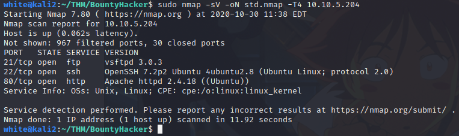
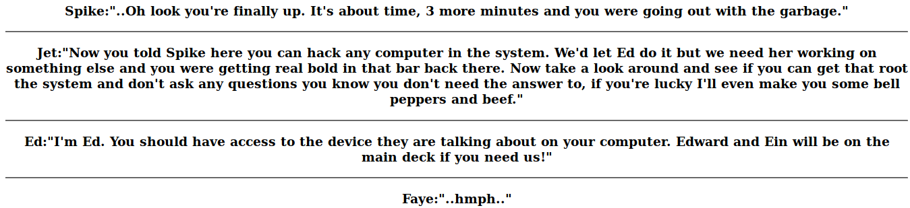
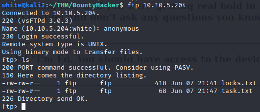
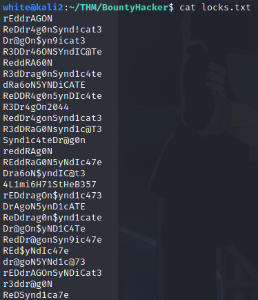
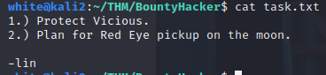
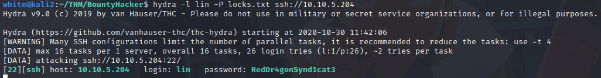
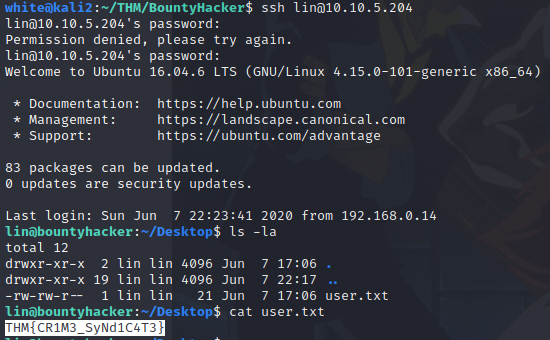
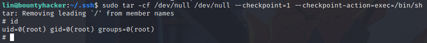
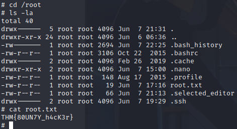

## Bounty Hacker

This is a really easy box, not much to get stuck on, no rabbit holes...

1. Starting with `nmap` for service on all ports

2. Visiting port 80 has nothing too interesting, nor the source code, only a conversation between the characters of Cowboy Bebop...

3. Without much to go on the web page, I tried the *FTP* service, which had anonymous login

4. After retrieving both files (`mget`)

The *locks.txt* locks like a passwords file, and *task.txt* gives a username: lin

5. Bruteforcing *ssh* with `hydra`, the username (lin) and the passwords file (*locks.txt*)

So I got lin's password: RedDr4gonSynd1cat3

6. Using the credentials from Hydra (lin:RedDr4gonSynd1cat3), the *user.txt* flag is in lin's home directory

7. The first thing I try when I get a shell is checking what I can run as sudo with `sudo -l`, which in this case was the `tar` command.

Checking the [GTFOBins](https://gtfobins.github.io/) for the `tar` command we can get a root shell with:

`tar -cf /dev/null /dev/null --checkpoint=1 --checkpoint-action=exec=/bin/sh`

8. Finally reading the root flag

