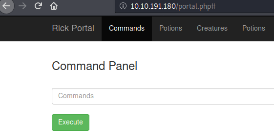

## Pickle Rick

1. Starting with nmap to do a service scan on all ports

2. Port 80

Nothing too interesting there... But analyzing the source code gives a username: R1ckRul3s

3. robots.txt has only one thing: Wubbalubbadubdub

4. With nothing else to go on, I tried gobuster to look for txt,js,py,php extensions

Two interesting pages there, login.php and portal.php.

5. Trying login.php

Trying portal.php page redirects back to login.php... 

6. I needed to authenticate, I already had a user (R1ckTul3s), but no password, so I tried the robots.txt entry (Wubbalubbadubdub) which worked and I got redirected to the portal.php page

7. The portal.php page is a simple web shell, but when trying `cat /etc/passwd`...

So this web shell is blacklisting some commands.. I also tried other commands to read files (`head`, `tail`, `more`.. ) they were all blacklisted...

8. I tried to enumerate the server a bit using `ls -la`

`ls -la`

`ls -la /home`

`ls -la /home/rick`

9. In the web server directory there is an ingredient and a clue.txt file, so I can access them

10. Rick's home directory also has an ingredient, although we cannot read it with the previously tried commands, so I tried `less /etc/passwd` wihch worked!

And from the previous enumeration I knew I could read the second ingredient file, but I wanted a reverse shell...

11. After trying a few one-liners from pentest monkey (`nc`'s version didn't have the `-e` option) the python reverse shell worked

12. First thing I try when I get a shell is check what I can run as sudo with `sudo -l`

So I can run anything without password, so I just went straight for the ingredients... 
This also means that I didn't even need the reverse shell, or any form of shell other than the web shell...

