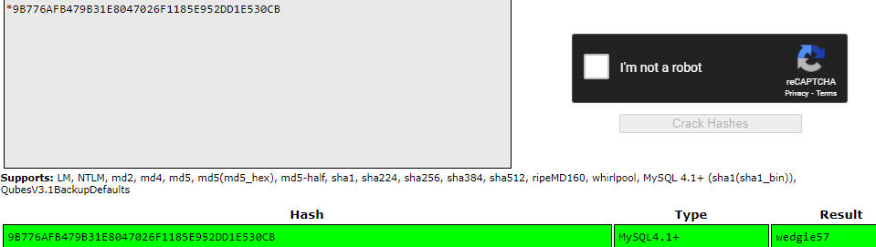

## DeRPNStiNK

So this is an easy box, but a long one, maybe there is a faster way, but this how I did it.

1. Starting with an `nmap` on all ports (`-p-`) (no service detection), with a fast scan (`-T4`)

*Note: This was done in our pratical class for CEH, so we were on a VPN, and everyone was scanning, so there was a bit of garbage, so I did another scan only on the open ports (21,22,80) with service detection*

All ports seem to have a recent version, so no exploits there...

2. So I visited the web page (port 80) which didn't have anything special

3. The source code had a reference to a */webnotes/info.txt* file

 
This file had a warning to *@stinky* (maybe a username: stinky)

4. The webnotes directory also had a bit of information

*Note: This is from Burp, because it is shown correctly in the browser ('\n' are not interpreted correctly)*

I think this was a rabbit hole, at least I don't remember using any information from here...

5. Looking at the *robots.txt*, there are two entries:

So nothing there...

6. Without much to go on, I tried the other services

No anonymous login in FTP

SSH requires public key authentication

So not much to do here yet...

7. Without much to go on, I tried `gobuster` for php,txt,js,py extensions

A new directory: */weblog*

8. The */weblog* directory is a wordpress blog for derpnstink professional services

9. Trying some basic user enumeration I got two wordpress users: admin (?author=0) and unclestinky (?author=1)

10. In order to check plugins, themes and possibly other users, I ran a `wpscan` which identified one plugin

So I searched for an exploit to that plugin with `searchsploit`, and it showed a file upload vulnerability

I also searched in `msfconsole` which has an exploit:

`unix/webapp/wp_slideshowgallery_upload`

*Note: I used the credentials admin:admin*

11. With the exploit running I got a reverse shell

12. Reading the `/etc/passwd` file I got both users: stinky (already saw it in the *info.txt* file) and mrderp

13. As in all installations of wordpress, the *wp-config.php* has the credentials to the MySQL database

So I got a username:password for the database (root:mysql)

14. Using `mysql` to read from the *mysql* database the *user* table I got unclestinky's password hash.

With [crackstation](crackstation.net) I got unclestincky password: wedgie57

15. As SSH (stinky) required RSA private key, this password was useless, so I tried to login to FTP with the user stinky, which worked!

16. The *ssh/* directory is nested, but in the end it is worth it because there is a private key!

17. The root FTP directory also had a *test.txt* file, and *network-logs/derpissues.txt* file

The file *test.txt* has nothing usefull, but *derpissues.txt* shows that user mrderp was having problems logging in to wordpress, and that stinky did a packet capture to solve the issue...

18. Using the private key found in with FTP, I logged into user stinky

19. Listing all directories in the home folder gives the first flag, and a *derpissues.pcap* packet capture file...

20. I used `wireshark` to analyze the *pcap* file, and as mrderp was having issues logging in, and had to change his password, I filtered the packets in order to show only POST requests, and searched until I found mrderp logging in

Password: derpderpderpderpderpderpderp

21. I tried SSH into mrderp user (which didn't require public key authentication) using the password I found in the *pcap* file

22. First thing I do when I get a shell is checking what I can run as sudo with `sudo -l`

So I can run anything in */home/mrderp/binaries/* that beings with *derpy* (I can execute any file with any extension sh, py, pl, php...)

23. I decided to do a simple `sh` script to get root shell

`
mkdir /home/mrderp/binaries;
echo "su -" > derpy.sh;
chmod +x derpy.sh;
sudo ./derpy.sh
`

So executing `./derpy.sh` gives root shell

