# Writeup of Morty's

1. Starting with nmap scan, stealth scan on all ports:

2. On nmap scan, the fingerprint of port 13337 gives one flag.

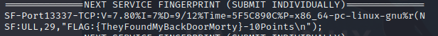

*Note: This could be confirmed by telnet*

3. Port 6000 metions Rick's half baked shell, using netcat to connect to it gives a simple shell to get next flag:

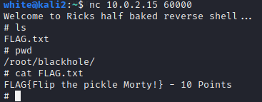

4. Visiting the website on port 80 doesn't show anything relevant... But inspection of HTML gives a password:

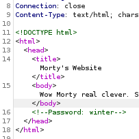

5. Robots.txt has 3 entries:
  * /cgi-bin/root_shell.cgi
  * /cgi-bin/tracertool.cgi
  * /cgi-bin/*
 
6. Starting wih the tracertool.cgi:
 
 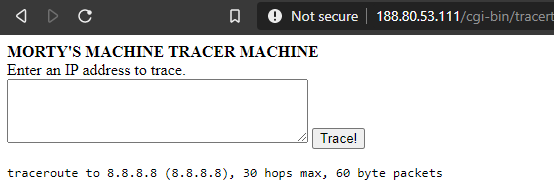
 
This can be vulnurable to injection attacks if the input is not properly sanitized. Inserting a ; and adding abritary commands, executes it. 
First thing, read /etc/passwd to get users with input *; more /etc/passwd* (cat is disabled, the binary is changed to print a cat): 

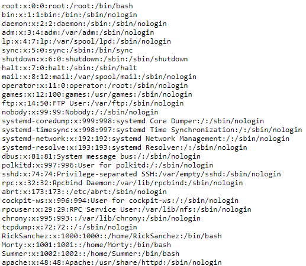

 4 relevant users: root, RickSanches, Summer, Morty.

7. Before moving on, visiting port 9090 gives another flag:

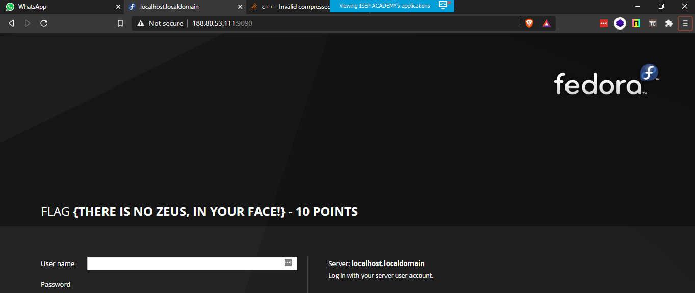

8. A dirbuster also finds a *passwords* directory with a new flag:

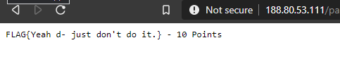

9. Now trying FTP port 21, asks for authentication (no anonymous login). Previously we found a password *winter*, which might be Summer's password.

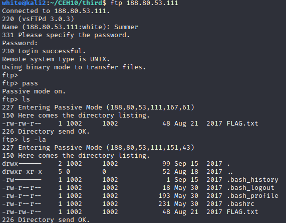
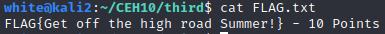

10. The same credentials can be used to ssh with Summer. By browsing around, Morty's home folder has 2 interesting files:
 * Safe_Password.jpg
 * journal.txt.zip
 Running strings on the image file gives the zip password:
 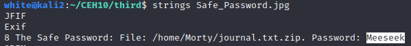
 
 Extracting the journal.txt.zip file gives a journal.txt with a new flag:
 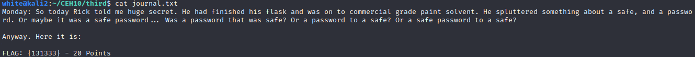

11. Rick's home folder has a binary *safe* which we don't have permissions to execute, but we can copy it, and change the permissions of the copy. 
The *safe* tells us to use command line arguments, and passing the previous 131333 gives a new flag and Rick's hint for his password:

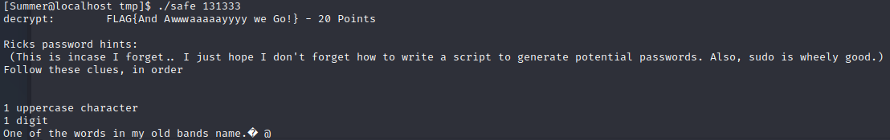

12. Ricks hints for his password: 1 upper case, 1 number, 1 word from his old band (The Flesh Curtains)
Writin a Python script to generate all possible passwords, and running an automated online password cracking tool such as Hydra gives Ricks password:
 
 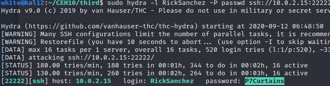
 
13. Rick has full sudo permissions, so we can just read the remaining flag, or get root shell:
 
 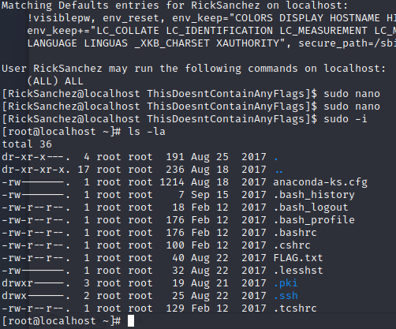
 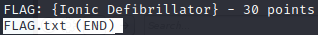
 
 
