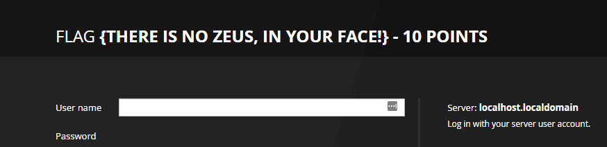

# Writeup of Morty's

1. Starting with nmap scan, stealth scan on all ports:

2. On nmap scan, the fingerprint of port 13337 gives one flag.

*Note: This could be confirmed by telnet*

3. Port 6000 metions Rick's half baked shell, using netcat to connect to it gives a simple shell to get next flag:

4. Visiting the website on port 80 doesn't show anything relevant... But inspection of HTML gives a password:

5. Robots.txt has 3 entries:
  * /cgi-bin/root_shell.cgi
  * /cgi-bin/tracertool.cgi
  * /cgi-bin/*
 
 6. Starting wih the tracertool.cgi:
 
 
 
This can be vulnurable to injection attacks if the input is not properly sanitized. Inserting a ; and adding abritary commands, executes it. 
First thing, read /etc/passwd to get users with input *; more /etc/passwd* (cat is disabled, the binary is changed to print a cat): 

4 relevant users: root, RickSanches, Summer, Morty.

7. Before moving on, visiting port 9090 gives another flag:

8. Now trying FTP port 21, asks for authentication (no anonymous login). Previously we found a password *winter*, which might be Summer's password.

9. The same credentials can be used to ssh with Summer. By browsing around, Morty's home folder has 2 interesting files:
 * Safe_Password.jpg
 * journal.txt.zip
 Running strings on the image file gives the zip password:
 
 
 Extracting the journal.txt.zip file gives a journal.txt with a new flag:
 
