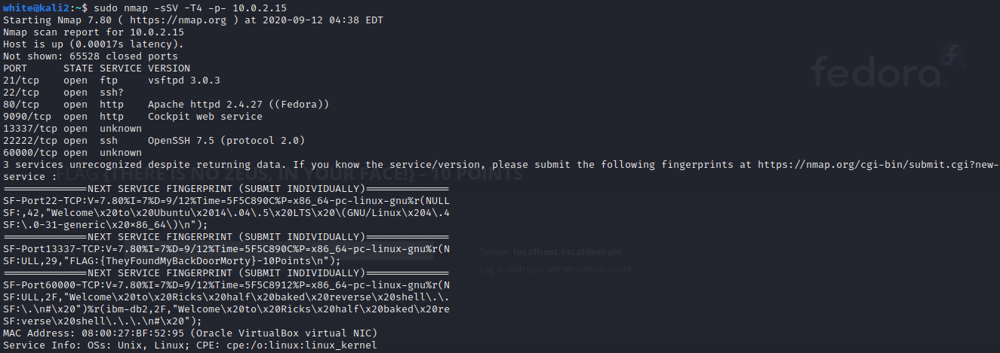

# Writeup of Morty's

1. Starting with nmap scan, stealth scan on all ports:

2. On nmap scan, the fingerprint of port 13337 gives one flag.

*Note: This could be confirmed by telnet*

3. Port 6000 metions Rick's half baked shell:

